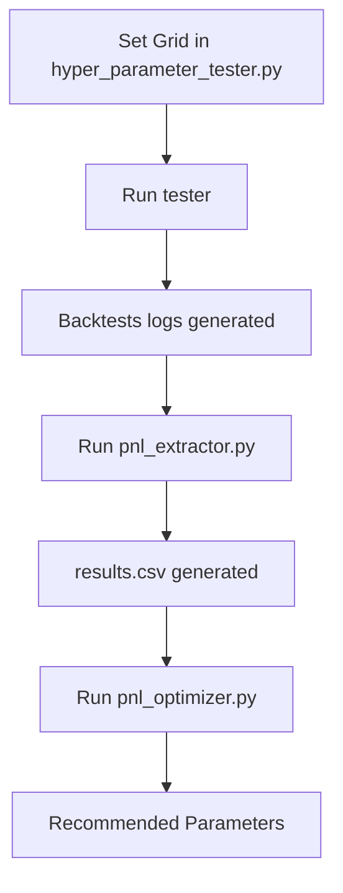

# Hyperparameter Tuning Suite for TOMATOES

I have implemented a robust hyperparameter tuning framework for the `TOMATOES` trading strategy. This suite allows you to perform systematic grid searches, extract performance data, and optimize parameters using polynomial fitting.

## Key Features

1.  **Parameterized Strategy**: `strategy/main.py` now loads hyperparameters from `strategy/tomato_params.json`, with a reliable hardcoded fallback.
2.  **Grid Search Tester**: `tuning/hyper_parameter_tester.py` iterates through parameter combinations, executing backtests and saving detailed logs.
    -   Supports **Sequential** and **Parallel** modes.
    -   Includes **progress bars** (via `tqdm`) or manual fallbacks.
    -   Handles **Windows Unicode issues** and descriptive filename generation.
3.  **PnL Extractor**: `tuning/pnl_extractor.py` parses backtest logs and consolidates results into a `results.csv`.
4.  **Polynomial Optimizer**: `tuning/pnl_optimizer.py` performs an $N^{th}$ degree fit to find the optimal parameter settings based on the extracted data.

## System Workflow



## How to Use

### 1. Perform Grid Search
Define your desired parameter ranges in `tuning/hyper_parameter_tester.py` and run the script:

```cmd
python tuning/hyper_parameter_tester.py --mode sequential
```

> [!TIP]
> Use `sequential` mode on Windows for maximum stability across multiple backtest runs.

### 2. Extract PnL Data
Scan the generated log files and create a consolidated CSV:

```cmd
python tuning/pnl_extractor.py
```

### 3. Identify Optimal Parameters
Perform a polynomial fit (e.g., $N=3$) to find the recommended parameter set:

```cmd
python tuning/pnl_optimizer.py --degree 3
```

## Integration with main.py

The `main.py` strategy is now configured to automatically use the values in `strategy/tomato_params.json` if the file exists. You can manually tweak this JSON file or let the tuning suite handle it.

```python
# From strategy/main.py
_TOMATO_DEFAULTS = {
    "alpha": 0.5,
    "n_sma": 20,
    "m_slope": 2,
    "slope_threshold": 0.1,
    "position_limit": 80,
}
```

---

> [!IMPORTANT]
> **Windows Compatibility**: All scripts have been tested to work with Windows `cp1252` encoding by replacing Unicode symbols with ASCII equivalents in console output.
